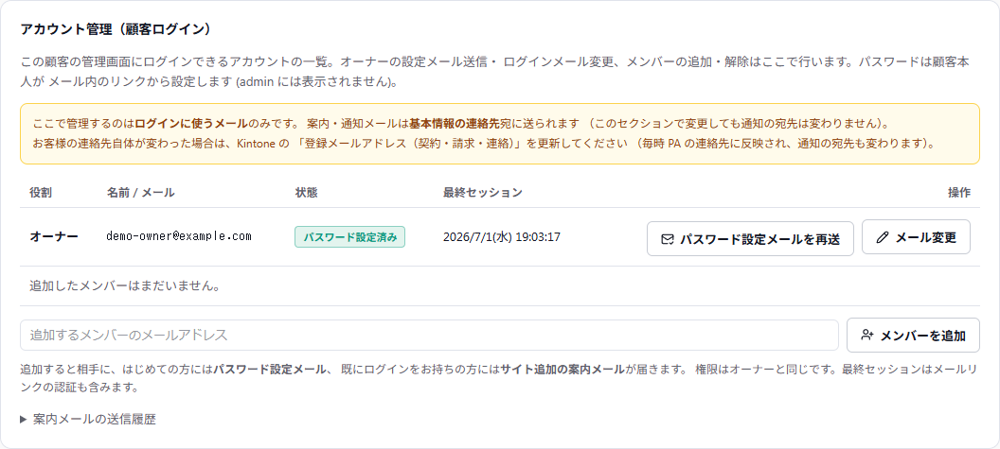
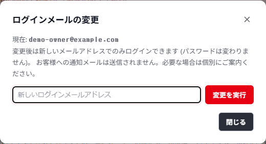
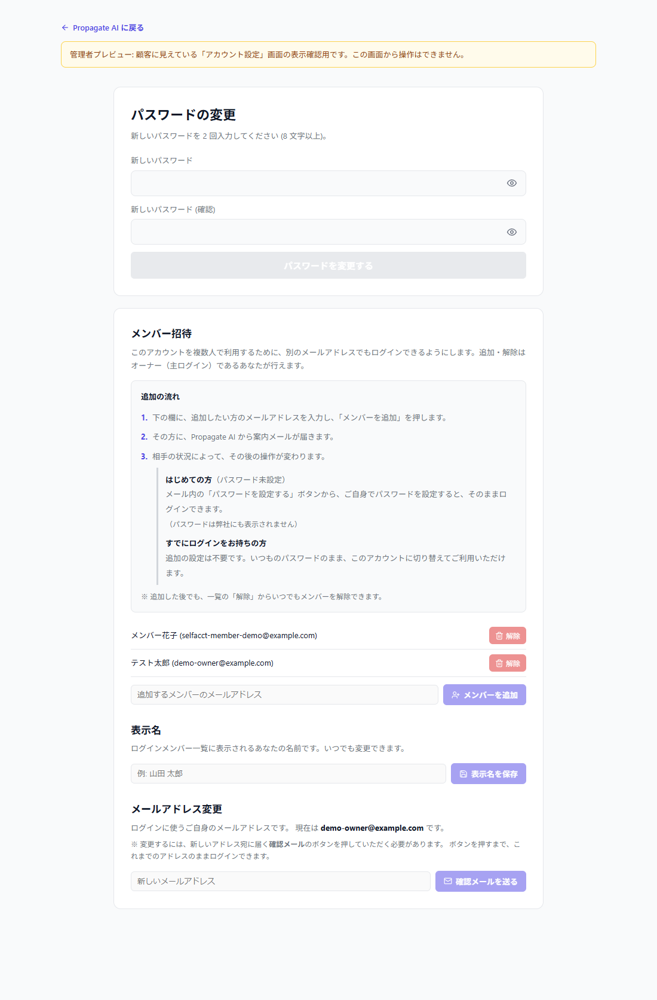

# 1. パートナーサクセス（PS）運用マニュアル

> 📋 **目次（アジェンダ）**
> 

> **1.** 基本原則
> 

> **2.** ルーティング手順（共通フロー）
> 

> **3.** ★ ステータス別アクションガイド — **顧客返答時に何をすべきか**
> 

> **4.** T列（phase_deadline）フェーズ期限日の設定基準
> 

> **5.** PSが直接対応できる範囲
> 

> **6.** エスカレーション基準
> 

> **7.** 制作進行シート カラム早見表
> 

> **9.** Propagate AI（マイページ）アカウント関連の対応
> 

> **10.** ブログCMS（記事編集画面）関連の対応
> 

> **11.** メール（Google Workspace）×ドメイン紐付けの対応
> 

> **12.** 既存サイト修正の対応
> 

> **13.** 顧客対応の共通原則
> 

> **14.** ドメイン接続の案内（AW列）
> 

---

# 1. 基本原則

PSの最も重要な役割は、**顧客からの連絡を受けて、M列またはN列のステータスを次のフェーズに変更し、業務依頼シートで適切な担当に連携すること**です。

> ⚠️ **Q列（ball_holder）は自動計算です。確認も変更も不要です。** M列・N列のステータスを変更すれば、Q列は自動的に正しい値に更新されます。
> 

---

# 2. ルーティング手順（共通フロー）

顧客から連絡を受けたら、以下の手順で対応します。

## Step 1：案件を特定する

制作進行シートのC列（client_name）で顧客名を検索します。

## Step 2：現在のステータスを確認する

M列（AI制作）またはN列（Wix制作）の現在のステータスを確認します。

## Step 3：ステータスを次のフェーズに変更する

顧客からの連絡内容に応じて、ステータスを次のフェーズに変更します。同時に**T列（phase_deadline）に新しいフェーズ期限日を設定**してください。

> 💡 **T列（フェーズ期限日）とK列（納品希望日）は別物です。** T列は各フェーズの作業期限、K列は営業が設定する全体の納品期日です。
> 

## Step 4：業務依頼シートに記入する

以下の表に従い、業務依頼シートの担当部署・担当者を記入します。

| 変更後ステータスの制作担当 | 担当部署 | 担当者 |
| --- | --- | --- |
| ポリッシュが作業するフェーズ | **記入不要** | 制作進行シートのステータス変更のみでOK |
| ディレクターがチェックするフェーズ | ディレクター | I列の担当者名 |
| 営業が対応するフェーズ | 営業 | H列の担当者名 |
| Wixデザイナーが作業するフェーズ | Wixデザイナー | J列の担当者名 |
| PSが直接対応する場合 | 記入不要 | — |

---

# 3. ★ ステータス別アクションガイド

> 🔄 **修正ツール自動遷移について（AI制作のみ）**
> 

> 顧客が修正ツールで修正を送信すると、M列のステータスは**自動で**以下のように変更されます。PSのM列手動変更は不要です。**T列（フェーズ期限日）はM列変更時に自動で+3営業日に設定されます**。別の期限が必要な場合は手動で上書きしてください。
> 

> ・ デモサイト提出済み → **デモサイト修正中**（自動）
> 

> ・ デモサイト修正済み（顧客確認中） → **デモサイト修正中**（自動）
> 

> ・ スマホ最適提出済み（顧客確認中） → **スマホ最適最終修正中**（自動）
> 

> 
> 

> メール・LINE経由の修正依頼の場合は、PSが手動でM列を変更してください。
> 

> 🎯 **このセクションの目的**: 顧客から連絡があったとき、**現在のステータスを見て「何をすべきか」を即座に判断できる**ようにするためのガイドです。
> 

## PSが対応する6つのフェーズ（一覧）

以下のステータスのとき、顧客から返答が届きます。PSはその返答内容に応じてステータス変更と連携を行います。

### AI制作（M列）

| # | 現在のM列ステータス | フェーズ | PSのやること（概要） |
| --- | --- | --- | --- |
| ① | **デモサイト提出済み** | デモサイト顧客確認 | 顧客返答に応じてM列を変更＋連携 |
| ② | **デモサイト修正済み（顧客確認中）** | 修正後の顧客再確認 | 顧客返答に応じてM列を変更＋連携 |
| ③ | **スマホ最適提出済み（顧客確認中）** | スマホ最適顧客確認 | 顧客返答に応じてM列を変更＋連携 |

### Wix制作（N列）

| # | 現在のN列ステータス | フェーズ | PSのやること（概要） |
| --- | --- | --- | --- |
| ④ | **先方提出完了（デモデザイン）** | デモデザイン顧客確認 | 顧客返答に応じてN列を変更＋連携 |
| ⑤ | **先方提出完了（デモサイト）** | デモサイト顧客確認 | 顧客返答に応じてN列を変更＋連携 |
| ⑥ | **先方提出完了（スマホ最適）** | スマホ最適顧客確認 | 顧客返答に応じてN列を変更＋連携 |

---

## ① デモサイト提出済み → 顧客から返答（AI制作）

> 📍 **いつこの対応が発生するか**: ディレクターが初回デモサイトを顧客に提出済みで、M列が「デモサイト提出済み」の状態で顧客から返答があったときです。
> 

**顧客の返答が「OK（スマホ最適へ進めてOK）」の場合:**

1. 制作進行シートでC列から案件を特定
2. 以下を操作:

| # | 列 | 操作 |
| --- | --- | --- |
| 1 | **M列** | 「**スマホ最適中**」に変更 |
| 2 | **T列** | フェーズ期限日を設定（**7営業日後**） |
| 3 | 業務依頼 | **記入不要**（制作進行シートで管理） |

> ➡️ **次の工程**: M列 =「スマホ最適中」（ボール: **ポリッシュ** → スマホ最適作業開始）
> 

**顧客の返答が「修正依頼」の場合:**

> 🔄 修正ツール経由の場合、M列は自動で「デモサイト修正中」に変更済みです。**T列のみ設定**してください。
> 
1. 制作進行シートでC列から案件を特定
2. 以下を操作:

| # | 列 | 操作 |
| --- | --- | --- |
| 1 | **M列** | 「**デモサイト修正中**」に変更（修正ツール経由なら自動変更済み） |
| 2 | **T列** | フェーズ期限日を設定（**3営業日後**） |
| 3 | 業務依頼 | **記入不要**（制作進行シートで管理） |

> ➡️ **次の工程**: M列 =「デモサイト修正中」（ボール: **ポリッシュ** → 修正対応＆顧客に再提出）
> 

**顧客の返答が「全面やり直し」の場合:**

1. 制作進行シートでC列から案件を特定
2. 以下を操作:

| # | 列 | 操作 |
| --- | --- | --- |
| 1 | **M列** | 「**デモサイト修正中**」に変更 |
| 2 | 業務依頼 | **ディレクター**（I列の担当者）に連携 → フェーズ期限日・方針をディレクターが判断 |

> ⚠️ 全面やり直しの場合、T列はディレクターが判断します。PSでは設定しないでください。
> 

> ➡️ **次の工程**: ディレクターがフェーズ期限日・方針を決定 → ポリッシュが対応
> 

---

## ② デモサイト修正済み（顧客確認中） → 顧客から返答（AI制作）

> 📍 **いつこの対応が発生するか**: ポリッシュが顧客FB修正を完了し再提出済みで、M列が「デモサイト修正済み（顧客確認中）」の状態で顧客から返答があったときです。
> 

**顧客の返答が「OK（スマホ最適へ）」の場合:**

| # | 列 | 操作 |
| --- | --- | --- |
| 1 | **M列** | 「**スマホ最適中**」に変更 |
| 2 | **T列** | フェーズ期限日を設定（**7営業日後**） |
| 3 | 業務依頼 | **記入不要** |

> ➡️ **次の工程**: M列 =「スマホ最適中」（ボール: **ポリッシュ**）
> 

**顧客の返答が「再修正」の場合:**

> 🔄 修正ツール経由の場合、M列は自動で「デモサイト修正中」に変更済みです。**T列のみ設定**してください。
> 

| # | 列 | 操作 |
| --- | --- | --- |
| 1 | **M列** | 「**デモサイト修正中**」に変更（修正ツール経由なら自動変更済み） |
| 2 | **T列** | フェーズ期限日を設定（**3営業日後**） |
| 3 | 業務依頼 | **記入不要** |

> ➡️ **次の工程**: M列 =「デモサイト修正中」（ボール: **ポリッシュ** → 再修正＆顧客に再提出）
> 

---

## ③ スマホ最適提出済み（顧客確認中） → 顧客から返答（AI制作）

> 📍 **いつこの対応が発生するか**: ディレクターがスマホ最適を顧客に提出済みで、M列が「スマホ最適提出済み（顧客確認中）」の状態で顧客から返答があったときです。
> 

**顧客の返答が「OK（公開へ）」の場合:**

| # | 列 | 操作 |
| --- | --- | --- |
| 1 | **M列** | 「**ドメイン接続中**」に変更 |
| 2 | 業務依頼 | **記入不要**（ドメイン接続フローへ） |

> 💡 **旧シートとの違い**: 旧シートではドメインステータスを「公開」に変更していましたが、新シートでは **M列を「ドメイン接続中」** に変更してください。ディレクターがドメイン接続・顧客最終確認を完了した後、ディレクターが「公開」に変更します。
> 

> ➡️ **次の工程**: M列 =「ドメイン接続中」（ボール: **顧客** → ドメイン接続作業開始。顧客の最終確認後、ディレクターが「公開」に変更して本番化）
> ※ 2026-05-08〜のシート仕様変更により、ボール表示は「顧客」になります。誤ってドメイン接続済み顧客にテンプレ送信→クレーム発展を防ぐためのフラグ仕様です。
> 

**顧客の返答が「修正依頼」の場合:**

> 🔄 修正ツール経由の場合、M列は自動で「スマホ最適最終修正中」に変更済みです。**T列のみ設定**してください。
> 

| # | 列 | 操作 |
| --- | --- | --- |
| 1 | **M列** | 「**スマホ最適最終修正中**」に変更（修正ツール経由なら自動変更済み） |
| 2 | **T列** | フェーズ期限日を設定（**3営業日後**） |
| 3 | 業務依頼 | **記入不要** |

> ➡️ **次の工程**: M列 =「スマホ最適最終修正中」（ボール: **ポリッシュ** → 修正＆顧客に再提出）
> 

---

## ④ 先方提出完了（デモデザイン） → 顧客から返答（Wix制作）

> 📍 **いつこの対応が発生するか**: ディレクターがデモデザインを顧客に提出済みで、N列が「先方提出完了（デモデザイン）」の状態で顧客から返答があったときです。
> 

**顧客の返答が「OK」の場合:**

| # | 列 | 操作 |  |
| --- | --- | --- | --- |
| 1 | **N列** | 「**デモサイト制作依頼中**」に変更 |  |
| 2 | 業務依頼 | **Wixデザイナー**（J列の担当者）に連携 |  |

> ➡️ **次の工程**: N列 =「デモサイト制作依頼中」（ボール: **Wixデザイナー**）
> 

**顧客の返答が「修正依頼」の場合:**

| # | 列 | 操作 |  |
| --- | --- | --- | --- |
| 1 | **N列** | 「**修正依頼中（デモデザイン）**」に変更 |  |
| 2 | 業務依頼 | **Wixデザイナー**（J列の担当者）に連携 |  |

> ➡️ **次の工程**: N列 =「修正依頼中（デモデザイン）」（ボール: **Wixデザイナー**）
> 

---

## ⑤ 先方提出完了（デモサイト） → 顧客から返答（Wix制作）

> 📍 **いつこの対応が発生するか**: デモサイトが顧客に提出済みで、N列が「先方提出完了（デモサイト）」の状態で顧客から返答があったときです。
> 

**顧客の返答が「OK」の場合:**

| # | 列 | 操作 |  |
| --- | --- | --- | --- |
| 1 | **N列** | 「**スマホ最適依頼中**」に変更 |  |
| 2 | 業務依頼 | **Wixデザイナー**（J列の担当者）に連携 |  |

> ➡️ **次の工程**: N列 =「スマホ最適依頼中」（ボール: **Wixデザイナー**）
> 

**顧客の返答が「修正依頼」の場合:**

| # | 列 | 操作 |
| --- | --- | --- |
| 1 | **N列** | 「**修正依頼中（デモサイト）**」に変更 |
| 2 | 業務依頼 | **Wixデザイナー**（J列の担当者）に連携 |

> ➡️ **次の工程**: N列 =「修正依頼中（デモサイト）」（ボール: **Wixデザイナー**）
> 

---

## ⑥ 先方提出完了（スマホ最適） → 顧客から返答（Wix制作）

> 📍 **いつこの対応が発生するか**: スマホ最適が顧客に提出済みで、N列が「先方提出完了（スマホ最適）」の状態で顧客から返答があったときです。
> 

**顧客の返答が「OK」の場合:**

| # | 列 | 操作 |
| --- | --- | --- |
| 1 | **N列** | 「**ドメイン接続中**」に変更 |
| 2 | 業務依頼 | **記入不要**（ドメイン接続フローへ） |

> 💡 **旧シートとの違い**: 旧シートではドメインステータスを「公開」に変更していましたが、新シートでは **N列を「ドメイン接続中」** に変更してください。ディレクターがドメイン接続・顧客最終確認を完了した後、ディレクターが「公開」に変更します。
> 

> ➡️ **次の工程**: N列 =「ドメイン接続中」（ボール: **顧客** → ドメイン接続作業開始。顧客の最終確認後、ディレクターが「公開」に変更して本番化）
> ※ 2026-05-08〜のシート仕様変更により、ボール表示は「顧客」になります。誤ってドメイン接続済み顧客にテンプレ送信→クレーム発展を防ぐためのフラグ仕様です。
> 

**顧客の返答が「修正依頼」の場合:**

| # | 列 | 操作 |
| --- | --- | --- |
| 1 | **N列** | 「**修正依頼中（スマホ最適）**」に変更 |
| 2 | 業務依頼 | **Wixデザイナー**（J列の担当者）に連携 |

> ➡️ **次の工程**: N列 =「修正依頼中（スマホ最適）」（ボール: **Wixデザイナー**）
> 

---

## 全体フロー図（PS視点）

```jsx
【AI制作フロー — PSの対応ポイント】

① デモサイト提出済み ← 顧客返答
        │
    ┌───┤
    │OK  │修正          │全面やり直し
    ↓    ↓              ↓
  スマホ  デモ修正中     デモ修正中
  最適中  ▶ポリッシュ    ▶ディレクター連携
  ▶ポリッシュ

② デモ修正済み（顧客確認中） ← 顧客返答
        │
    ┌───┤
    │OK  │再修正
    ↓    ↓
  スマホ  デモ修正中
  最適中  ▶ポリッシュ
  ▶ポリッシュ

③ スマホ最適提出済み（顧客確認中） ← 顧客返答
        │
    ┌───┤
    │OK  │修正
    ↓    ↓
  ドメイン  スマホ最終修正中
  接続中   ▶ポリッシュ
  ▶ディレ
```

---

# 4. T列（phase_deadline）フェーズ期限日の設定基準

| プラン | デモサイト制作 | 修正 | スマホ最適 |
| --- | --- | --- | --- |
| BASIC（WIX） | 7営業日 | **7営業日** | 7営業日 |
| STANDARD / ADVANCE（WIX） | 12営業日 | **7営業日** | 7営業日 |
| AI制作（全プラン） | 7営業日 | **3営業日** | 7営業日 |

> ⚠️ 営業日の数え方：依頼日はカウントしない（翌営業日を1日目）。土日祝はカウントしない。
> 

> 📅 **顧客への修正対応目安の案内（2026-07-08〜）**: お客様から「修正にどれくらいかかりますか？」と聞かれた場合、**AI案件は基本2営業日**を目安にご案内してください（WIX案件は従来通り）。ただし修正内容が多い場合や、確認・調整に時間がかかる内容の場合は「内容によっては5営業日ほどお時間をいただく場合もございます」とご案内してください。納品後の修正・更新対応も「原則2営業日以内」でご案内します。
> 

> 🔧 **制作フロー変更（2026-07-08〜）**: サイト修正は **PC版・スマホ版をまとめて調整**する運用に変わりました（以前のようにPC版制作後に別フェーズでスマホ版を進める形ではありません）。お客様から修正依頼をいただいた際は、**修正ツール（サイトアノテーター）のURL**をご案内してください。
> 

---

# 5. PSが直接対応できる範囲

以下はPSが自身で対応し、他のポジションへの連携は不要です。

- サービス概要・料金・契約内容に関する基本的な質問への回答
- フェーズ期限日の目安案内（上記テーブル参照）
- ドメイン接続の初回案内（LINE定型文）
- Google Search Consoleのデータ共有
- 解約手続き（フォーム送付 → Kintone更新 → 経理連携）
- Wixブログ権限の付与
- フォーム通知先の確認
- **Propagate AI（マイページ）のアカウント対応**: メンバー（追加ログイン）の追加・解除 / ログインメールの変更 / パスワード設定メールの再送（→ 手順は **9章**）
- **ブログCMSの対応**: ログイン案内 / 編集メンバーの追加 / パスワード再設定（→ 手順は **10章**）
- **メール（Google Workspace）とドメインの紐付け対応**: 所有権確認のTXT設定 / MX切替 / 設定代行（→ 手順は **11章**）

---

# 6. エスカレーション基準

| 状況 | 連携先 |
| --- | --- |
| クレーム・強い不満 | ディレクター（I列） |
| 追加料金が発生しうる要望 | 営業（H列） |
| 契約・請求関連の問い合わせ | 営業（H列） |
| 技術的な質問（PSで回答不可） | ディレクター（I列） |
| 解約の意思表明 | 営業（H列） |
| 初回打ち合わせの日程調整 | ゆうこさん |
| 全面やり直しの要求 | ディレクター（I列） |
| 大幅修正のフェーズ期限日判断 | ディレクター（I列） |
| Propagate AI アカウント関連で **9章の手順でも解決しない** 場合 | 開発チーム（鈴木貴登） |

---

# 7. タブ自動移動ルール（PSが知っておくべきこと）

以下のタブ移動はGASにより自動で行われます。PSの手動操作は不要です。

| 移動 | 条件 | PSへの影響 |
| --- | --- | --- |
| メイン → **長期未返信** | Q列=顧客 & T列から30日経過（毎朝7時自動チェック） | メインタブから消えるが、「長期未返信」タブに移動しているだけ。顧客から返答があればステータス変更で自動復帰 |
| メイン → **制作中解約** | kintone受注ステータス=解約（毎朝7時自動チェック） | 解約手続きを行った案件は自動で移動される |
| メイン ↔ **未払い停止** | L列チェックボックスON/OFF | 未払いの案件は自動で停止タブに移動 |
| メイン → **完了** | AK-AP列6条件達成（確認ダイアログ付き） | ディレクターが完了処理を行うと自動移動 |

> 💡 **「長期未返信」タブの案件は、M列またはN列のステータスが変更されると自動でメインに戻ります。** 顧客から返答があった場合、通常通りステータス変更を行えばOKです。
> 

---

# 8. 制作進行シート カラム早見表（PS関連）

| 列 | 名前 | PSの操作 |
| --- | --- | --- |
| C | client_name | 案件検索に使用 |
| H | sales_rep | 営業の連携先を特定 |
| I | director | ディレクターの連携先を特定 |
| J | wix_producer | Wixデザイナーの連携先を特定 |
| L | is_unpaid | 未払い状況の確認 |
| M | overall_status（AI） | **ステータス変更（AI制作の場合）** |
| N | wix_status（Wix） | **ステータス変更（Wix制作の場合）** |
| Q | ball_holder | 自動計算。**確認不要・変更禁止** |
| T | phase_deadline | **ステータス変更時にフェーズ期限日を設定** |

---

# 9. Propagate AI（マイページ）アカウント関連の対応

> 🎯 **このセクションの目的**: 公開後の顧客が利用する「Propagate AI」（https://www.propagate-ai.com ─ 顧客はマイページとして利用）のログインアカウントに関する問い合わせを、**PSだけで完結できる**ようにするためのガイドです。2026-07-02 に管理画面へ「アカウント管理」セクションが追加され、開発チームに依頼せず対応できるようになりました。
> 

## 9-1. 対応フローの原則（3段階エスカレーション）

| 段階 | 対応者 | 内容 |
| --- | --- | --- |
| ① | **顧客自身** | マイページ右上「アカウント設定」から自分で操作できます。**まずこれを定型文で案内**します |
| ② | **PS** | 顧客が操作できない・急ぎの場合、PSが管理画面で代行します |
| ③ | **開発チーム** | ②でも解決しない場合のみエスカレーションします（条件は 9-5） |

> ⚠️ いきなり②や③に行かず、**まず①（顧客自身での解決）を案内する**のが原則です。①で解決しなければ②、②でも解決しなければ③、の順を徹底してください。
> 

## 9-2. 管理画面の開き方と画面の見方

> ⚠️ **送信前チェック（初回ログイン用メール／初回案内を送る前に必ず）**
>
> **このチェックの対象**: 提案通知メール／初回案内、および **ブログが無いお客様**への「初回ログイン用メールを送信」。
> **対象外（サイト公開前でも進めてよいもの）**: **ブログをご利用のお客様**。2026-07-17 から、ブログがあるお客様は「リリース不可」でも初回ログイン用メールを送信でき、ブログ編集のメンバー追加もできます（→ **10-2 ケースE**）。ブログ目的の対応をこのチェックで止めないでください。
>
> 顧客詳細ページ上部の「**PA 運用状態**」バッジを必ず確認します。
> - 「**配信可能**」→ 送ってよい
> - 「**リリース不可 / 対象外**」→ 送らない
>
> リリース不可 = 計測未接続・サイト未到達などでダッシュボードが空（0）の状態。この状態で案内するとログイン後に「0」の画面を見せることになり、不信・問い合わせにつながります。計測セットアップ（GA4／サイト接続等）の完了を待つ・依頼し、「配信可能」に変わってから送ってください（根拠は「リリース不可の根拠」＝ドメイン接続／Site URL／GA4／GSC で確認）。
>
> なお「初回ログイン用メールを送信」ボタンは、リリース不可の顧客には**押せない／送信できない**よう自動で止まります。ただし **LINE・メールでの手動案内は止まらない**ため、上記の確認を必ず行ってください。

1. https://www.propagate-ai.com/admin/customers を開き、顧客名で検索 → 顧客詳細ページへ
2. 「**アカウント管理（顧客ログイン）**」セクション（「PA 運用状態」のすぐ下）を使います



**画像の見方:**

- **役割**: 「オーナー（主ログイン）」は1人。「メンバー（追加ログイン）」は複数追加でき、**権限はオーナーと同じ**です
- **状態バッジ**: 「パスワード設定済み」（緑）= ログインできる状態 / 「パスワード未設定」= 案内メール送付後、お客様がまだパスワードを設定していない / 「ログイン未発行」= 初回ログイン用メールが未送信
- **最終セッション**: 最後にログイン（またはメール内リンクの認証）をした日時。「—」なら一度も利用がありません
- **黄色の注意書き（重要）**: このセクションで変わるのは**ログインに使うメールだけ**です。案内・通知メールの宛先（基本情報の連絡先）は変わりません。**お客様の連絡先自体が変わった場合は Kintone の「登録メールアドレス（契約・請求・連絡）」を更新**してください（毎時 Propagate AI に反映され、通知の宛先も変わります）

## 9-3. ケース別対応手順

### ケースA: 「スタッフ（別の担当者）もログインできるようにしたい」

**① まず顧客への案内（定型文）:**

> Propagate AI のマイページ右上「アカウント設定」→「メンバー招待」から、追加したい方のメールアドレスを入力するだけでご追加いただけます。追加された方には設定のご案内メールが自動で届きますので、そのままご利用を開始いただけます。
> 

**② PSが代行する場合:**

| # | 操作 |
| --- | --- |
| 1 | アカウント管理セクション下部の入力欄に、追加するメールアドレスを入力 |
| 2 | 「**メンバーを追加**」を押す（確認ダイアログ → OK） |

- 相手には**自動でメールが届きます**（はじめての方 = パスワード設定メール / 既にログインをお持ちの方 = サイト追加の案内メール）。PSからの追加案内は不要です
- ただし、**既にメンバーになっているアドレス**をもう一度追加した場合は「既にメンバーです」となり、メールは届きません（重複登録にはならず、相手はそのまま利用できます）
- 解除したいときは一覧の「**解除**」ボタン（相手のアカウント自体は消えません）

### ケースB: 「ログインに使うメールアドレスを変えたい」

> ⚠️ **最初に必ず確認**: 「連絡先（通知・請求のメール）ごと変わる」のか、「ログインだけ別のアドレスにしたい」のか。
> 

**連絡先ごと変わる場合** → 管理画面では操作せず、**Kintone の「登録メールアドレス（契約・請求・連絡）」を更新**します（毎時 Propagate AI の連絡先に反映され、通知の宛先も変わります）

- この変更で**お客様に自動送信されるメールはありません**（ログインのご案内メールも自動では送られません）。アドレス変更を伝えたい場合は、PSから個別にご連絡ください
- **ログインへの影響**は、お客様の状態によって変わります:
    - **一度もログインしていない**（ログイン未発行の）お客様 → 追加の対応は不要です。ログインが必要になったタイミングで、ログイン画面（https://www.propagate-ai.com/login）の「**初めての方はこちら**」からご本人に発行いただいてください（案内メールのリンクは約1時間で失効するため、PSが発行して転送するよりご本人操作のほうが確実です）
    - **既にログインをお持ち**のお客様 → Kintone の変更では**ログインに使うメールは変わりません**（従来のアドレスのままログインできます）。ログインメールも新しいアドレスにしたい場合は、下の「ログインだけ変えたい場合」の手順を追加で実施してください

**ログインだけ変えたい場合:**

**① まず顧客への案内（定型文）:**

> Propagate AI のマイページ右上「アカウント設定」→「メールアドレス変更」から、ご自身で変更いただけます。新しいアドレス宛に届く確認メールのボタンを押すと変更が完了します（押すまでは今のアドレスでログインできます）。
> 

**② PSが代行する場合:**

| # | 操作 |
| --- | --- |
| 1 | オーナー行の「**メール変更**」を押す |
| 2 | モーダルに新しいメールアドレスを入力 →「変更を実行」（確認ダイアログ → OK） |



- PS代行の場合は**即時に切り替わり、お客様への自動通知はありません**。変更した旨と「次回から新しいアドレスでログインしてください（パスワードは変わりません）」を必ず個別に案内してください

### ケースC: 「ログインできない / パスワードを忘れた」

**① まず顧客への案内（定型文）:**

> Propagate AI のログイン画面（https://www.propagate-ai.com/login）の「**パスワードをお忘れの方はこちら**」から、ご登録のメールアドレスを入力いただくと、パスワード再設定のご案内メールが届きます。初めてログインされる方は「初めての方はこちら（パスワードを設定する）」をご利用ください。
> 

**② PSが代行する場合:**

| # | 操作 |
| --- | --- |
| 1 | オーナー行の「**パスワード設定メールを再送**」を押す（確認ダイアログ → OK） |
| 2 | 送信済みかどうかは同セクションの「案内メールの送信履歴」（クリックで展開）で確認できます |

- お客様は届いたメールから自分で新しいパスワードを設定します（パスワードは弊社側にも表示されません）

## 9-4. 顧客画面（マイページ）側でできること

顧客はマイページ右上の「**アカウント設定**」から、以下を**自分で**操作できます。PSが代行する前に、まずこちらを案内してください。

- **メンバー招待・解除**（オーナーのみ）
- **表示名の変更**
- **メールアドレス変更**（新メール宛の確認リンクで確定する安全方式）
- **パスワード変更**



- ※ 上の画像は管理画面のプレビュー機能で撮影したものです。**顧客の画面には上部の黄色い「管理者プレビュー」バナーは表示されません**
- 顧客に見えている画面をPSが確認するには: 顧客詳細の「**顧客 UI を直接開く**」→ 開いた画面の右上「アカウント設定」（閲覧専用プレビューが開きます。操作はできません）

## 9-5. 開発チームへのエスカレーション条件

以下に当てはまる場合**のみ**、開発チーム（鈴木貴登）へ連携してください。それ以外は 9-3 の手順でPS完結できます。

| 状況 | 補足 |
| --- | --- |
| メール変更時に「**別のログインアカウントで既に使われています**」エラー | アカウントの統合・整理が必要なため開発対応 |
| 「**同じログインアカウントを別の顧客が参照しています**」エラー | 顧客データの紐付け整理が必要なため開発対応 |
| 設定メールを再送しても、お客様がログインできない状態が続く | メール到達性・認証リンクの調査が必要 |
| アカウント管理セクション自体の表示エラー・操作エラー | 不具合の可能性 |

> 💡 エスカレーション時は「顧客名 / 顧客ID / 実施した操作 / 出たエラーメッセージ（そのままコピー）」を添えてください。
> 

## 9-6. 「お問い合わせ件数」のカウント基準（お客様からの質問対応用）

Propagate AI の「お問い合わせ」件数について、お客様から質問があった場合は以下を案内してください。

- お問い合わせ件数には、**フォーム送信だけでなく、サイト上の電話番号タップ・メールアドレスタップも含まれます**。
- **通知メールが届くのはフォーム送信のみ**です。電話番号タップ・メールアドレスタップでは通知メールは送信されません。
- **電話番号タップは 1タップ＝1件**としてカウントされます。
- フォーム送信履歴とお問い合わせ件数が一致しない場合があります（弊社のテスト送信はお客様画面では非表示となっているため）。
- ご希望があれば、「お問い合わせ」件数を**フォーム送信のみのカウントに変更**することも可能です（その場合、電話番号タップ・メールアドレスタップは件数に含まれません）。

# 10. ブログCMS（記事編集画面）関連の対応

> 🎯 **このセクションの目的**: ブログ機能をご利用のお客様が記事を書く「ブログCMS」に関する問い合わせを、**PSだけで完結できる**ようにするためのガイドです。
> 

> ⚠️ **2026-07-07 の重要変更**: 旧ブログCMSの専用ログイン画面（紺色の画面）は**廃止**され、ログインは **Propagate AI（マイページ）に統一**されました。パスワードは移行済みのため、お客様は**これまでと同じメールアドレス・同じパスワード**でそのままログインできます。旧画面のブックマークからも自動で新しいログイン画面に移動します。
> 

> ✅ **2026-07-17 の変更（PS の対応範囲が広がりました）**: **サイト公開前（PA 運用状態が「リリース不可 / 準備中」）のお客様にも、ブログをご利用いただけます**。ブログがあるお客様は「初回ログイン用メールを送信」ボタンが公開前でも押せるようになり、ブログ編集のメンバー追加もできます。9-2 の送信前チェックは**ブログをご利用のお客様には適用されません**。制作中のお客様からの「公開前に記事を入れておきたい」「実際の表示を試したい」というご要望は、**鈴木への確認なしでそのまま受けて対応してください**（→ **10-2 ケースE**）。
> 

## 10-1. 顧客のログイン方法（まずこれを案内）

**顧客への案内（定型文）:**

> ブログの編集は、Propagate AI（https://www.propagate-ai.com/login）にログイン後、画面上部の「**ブログを書く**」ボタンからご利用いただけます。ログインはこれまでのメールアドレス・パスワードがそのままご利用いただけます（Google でログインされていた方は、ログイン画面の「Google でログイン」からお入りください）。
> 

- ブログ編集画面を直接開く URL: https://www.propagate-ai.com/blog-cms （未ログインの場合はログイン画面に移動します）
- 「ブログを書く」ボタンは**ブログ機能があるお客様にだけ**表示されます
- 編集画面には初回チュートリアル（ようこそツアー）と「よくある質問」ページが組み込まれています。操作方法の質問はまずこちらを案内してください

## 10-2. ケース別対応手順

### ケースA: 「ブログにログインできない / パスワードを忘れた」

対応は **9章 ケースC と完全に同じ**です（ブログ専用のパスワードは存在せず、Propagate AI のアカウントを使うため）。

**① まず顧客への案内（定型文）:**

> Propagate AI のログイン画面（https://www.propagate-ai.com/login）の「**パスワードをお忘れの方はこちら**」から、ご登録のメールアドレスを入力いただくと、パスワード再設定のご案内メールが届きます。再設定後、画面上部の「ブログを書く」からブログ編集をご利用いただけます。
> 

**② PSが代行する場合:** 顧客詳細の「アカウント管理」→ オーナー行の「**パスワード設定メールを再送**」（9-3 ケースC参照）

### ケースB: 「別のスタッフもブログを書けるようにしたい」

ブログの編集権はログインアカウント単位です。以下のどの方法でも結果は同じで、**追加された方には設定メールが自動で届きます**（はじめての方 = パスワード設定メール / 既にログインをお持ちの方 = サイト追加の案内メール）。追加後に PS から個別の設定案内を送る必要はありません。

- **① 顧客自身**: マイページ右上「アカウント設定」→「メンバー招待」
- **② PSが代行（顧客詳細から）**: 顧客詳細の「アカウント管理」→「メンバーを追加」（9-3 ケースA参照）
- **③ PSが代行（ブログ管理から）**: ブログの立ち上げ時や、**ご本人以外のスタッフに渡す**場合はこちら（→ ケースE）。サイトとお客様の紐付けも同時に行われるため、「ブログを書く」が出ないときの復旧にも使えます

**③ ブログ管理からの追加手順:**

| # | 操作 |
| --- | --- |
| 1 | https://www.propagate-ai.com/admin/blog-cms でサイト名を検索 → サイト詳細を開く |
| 2 | 「**メンバー管理**」に追加するメールアドレスを入力して追加 |
| 3 | 完了。相手には設定メールが自動で届きます（送信された旨は追加時のメッセージに表示されます） |

- 「このサイトは顧客に紐付いておらず…」というエラーが出た場合は、サイトと顧客の紐付けが未設定です。**顧客の登録メールアドレス（Kintone の連絡先）で追加**すると自動で紐付きます。それでも解決しない場合は開発チームへ（10-4）
- メンバー管理から「削除」しても、相手のログインアカウント自体は消えません（そのサイトへの表示が外れるだけです）

### ケースC: 「ログインできたのに『ブログを書く』ボタンが出ない / サイトが表示されない」

ブログサイトとお客様アカウントの紐付けに問題がある可能性があります。**開発チームへエスカレーション**してください（10-5）。

### ケースD: 「記事が自分のホームページに反映されない」

公開ボタンを押してから反映まで数分かかる場合があります。10分以上経っても反映されない場合は**開発チームへエスカレーション**してください（サイトの構成によって再ビルドが必要なことがあります）。

### ケースE: 「サイト公開前だが、先にブログを触れるようにしたい」

制作中（PA 運用状態が「**リリース不可 / 準備中**」）のお客様でも**付与できます**。「公開開始の時点である程度記事が入っている状態にしたい」「実際に載せたらどう見えるか試したい」といったご要望は、そのまま受けて対応してください。

**誰に渡すかで操作が分かれます。**

| # | 渡す相手 | 操作 |
| --- | --- | --- |
| 1 | **お客様ご本人**（＝ Kintone の登録メールアドレス） | 顧客詳細 →「アカウント管理」→ オーナー行の「**初回ログイン用メールを送信**」 |
| 2 | **ご本人以外**（広報担当など、別の方のアドレス） | **10-2 ケースB③（ブログ管理からの追加）** |
| 3 | いずれの場合も | 顧客へ**定型文⑦**（10-4）を送る |

- ご本人のアドレスは 1 の経路を使ってください。2 でも編集はできますが、そのお客様の「オーナー（主ログイン）」の欄が空のままになり、管理画面の表示が「ログイン未発行」で止まります
- ⚠️ **同じメールアドレスで別の会社の Propagate AI を既にご利用のお客様**は、1 を押すと**自動でアカウントが束ねられ、「サイト追加のご案内」メール**が送られます（想定どおりの動作です。画面にも束ねた旨が表示されます）
- ⚠️ **ログインできるのに「ブログを書く」が出ない**場合は、サイトとお客様の紐付けがありません。**ブログ管理から追加**すると紐付きます（この経路だけが紐付けも同時に行います）。それでも出ない場合は開発チームへ（10-5）
- お客様がログイン後に見る画面は「**準備中**」表示になり、**ブログ機能のみ**ご利用いただけます（アクセス分析などは公開後に順次表示されます）。この案内はお客様の画面上にも表示されます
- 公開前にご投稿いただいた記事は**そのまま保存され、公開後も引き続き掲載されます**
- ブログが無いお客様には渡せません（ボタンも押せません）。ブログ管理でサイトが見つからない場合は開発チームへ（10-5）

## 10-3. スタッフ（社内）がブログを編集する場合

- 社内スタッフによる顧客ブログの閲覧・編集は https://www.propagate-ai.com/admin/blog-cms （管理画面）を使います
- 旧ブログCMSの専用ログインは廃止済みです。**顧客用の /blog-cms 画面には社内アカウントでは入れません**（お客様に見えている画面を確認したい場合は、顧客詳細の「顧客 UI を直接開く」を使います）

## 10-4. 先方への案内 定型文集

お客様への返信にそのまま使える文面です（Propagate Desk / メール共通）。**時間制限を促す文言（「お早めに」等）は入れない**のがルールです。

### 定型文①: ブログのご利用開始（権限付与の完了報告）

> ブログ機能のご用意が完了いたしましたので、ご報告いたします。
> 
> ご登録のメールアドレス宛に「パスワード設定のご案内」メールをお送りしております。メール内のボタンからパスワードをご設定いただくと、ご利用を開始いただけます。
> 
> ▼ブログの書き方
> 1. https://www.propagate-ai.com/login にログイン
> 2. 画面上部の「ブログを書く」ボタンから、記事の作成・編集ができます
> （編集画面に操作のご案内と「よくある質問」もご用意しております）
> 
> 万一ご案内メールが見当たらない場合や、リンクが無効と表示された場合は、ログイン画面の「初めての方はこちら（パスワードを設定する）」からご登録のメールアドレスを入力いただくと、あらためて設定メールをお受け取りいただけます。ご不明な点がございましたら、本メールにご返信ください。

### 定型文②: すでに Propagate AI をご利用中のお客様への完了報告

> ブログ機能のご用意が完了いたしましたので、ご報告いたします。
> 
> いつもお使いの Propagate AI アカウントでそのままご利用いただけます。https://www.propagate-ai.com/login にログイン後、画面上部の「ブログを書く」ボタンから記事の作成・編集をお試しください。

### 定型文③: 「ブログはどこから編集できますか？」（ログイン方法の質問）

> ブログの編集は Propagate AI からご利用いただけます。
> 
> https://www.propagate-ai.com/login に、これまでのメールアドレス・パスワードでログイン後、画面上部の「ブログを書く」ボタンからお入りください。Google でログインされていた方は、ログイン画面の「Google でログイン」をご利用いただけます。

### 定型文④: 「ログインできない / パスワードを忘れた」

> ご不便をおかけしております。
> 
> ログイン画面（https://www.propagate-ai.com/login）の「パスワードをお忘れの方はこちら」から、ご登録のメールアドレスを入力いただくと、パスワード再設定のご案内メールが届きます。再設定後、画面上部の「ブログを書く」からブログ編集をご利用いただけます。
> 
> お試しいただいてもログインできない場合は、お手数ですが本メールにご返信ください。こちらで設定状況を確認のうえご案内いたします。

### 定型文⑤: メンバー追加の完了報告（「◯◯さんも書けるようにして」への返信）

> ご依頼いただきました◯◯様のご登録が完了いたしました。
> 
> ◯◯様のメールアドレス宛に設定のご案内メールをお送りしておりますので、メールに沿ってご利用を開始いただけます。ログイン後は画面上部の「ブログを書く」から記事の作成・編集が可能です。

### 定型文⑥: 操作方法のご質問（書き方・公開のしかた等）

> ブログ編集画面では、初回ログイン時に操作のご案内（チュートリアル）が表示されるほか、画面内の「よくある質問」からも操作方法をご確認いただけます。
> 
> ご覧いただいてもご不明な場合は、「どの画面で」「何をしようとして」「どうなったか」をお知らせいただけましたら、担当がご案内いたします。

### 定型文⑦: 公開前のブログご利用開始（制作中のお客様への完了報告 / ケースE）

> ブログ機能のご用意が完了いたしましたので、ご報告いたします。
> 
> ご登録のメールアドレス宛に「パスワード設定のご案内」メールをお送りしております。メール内のボタンからパスワードをご設定いただくと、ご利用を開始いただけます。
> 
> ▼ブログの書き方
> 1. https://www.propagate-ai.com/login にログイン
> 2. 画面上部の「ブログを書く」ボタンから、記事の作成・編集ができます
> （編集画面に操作のご案内と「よくある質問」もご用意しております）
> 
> ▼ご留意点
> 現在サイトは公開前のため、ログイン後の画面は「準備中」と表示されます。公開前の期間は、ブログ機能のみご利用いただけます（アクセス分析などはサイト公開後に順次表示されます）。今のうちにご投稿いただいた記事はそのまま保存され、サイト公開後も引き続き掲載されます。
> 
> 万一ご案内メールが見当たらない場合や、リンクが無効と表示された場合は、ログイン画面の「初めての方はこちら（パスワードを設定する）」からご登録のメールアドレスを入力いただくと、あらためて設定メールをお受け取りいただけます。ご不明な点がございましたら、本メールにご返信ください。

## 10-5. 開発チームへのエスカレーション条件

以下に当てはまる場合**のみ**、開発チーム（鈴木貴登）へ連携してください。

| 状況 | 補足 |
| --- | --- |
| ログインできるのに「ブログを書く」が出ない / サイト一覧が空 | ブログサイトと顧客の紐付け調査が必要 |
| パスワード設定メールを再送しても入れない状態が続く | メール到達性・認証の調査が必要 |
| 記事を公開しても10分以上ホームページに反映されない | 配信経路・再ビルドの調査が必要 |
| 編集画面の表示エラー・保存エラー | 不具合の可能性 |

> 💡 エスカレーション時は「顧客名 / 顧客ID / 実施した操作 / 出たエラーメッセージ（そのままコピー）」を添えてください。
> 

---

# 11. メール（Google Workspace）× ドメイン紐付けの対応

> 🎯 **このセクションの目的**: お客様が Google Workspace（GWS）等で独自ドメインのメール（例: info@example.co.jp）を利用するための「ドメイン所有権の確認」「MXレコード設定」に関する問い合わせを、**PSだけで判断・完結できる**ようにするためのガイドです。「先方のGoogle Workspace × 弊社管理ドメインの接続」がマニュアルに無く都度確認が発生していたため、2026-07 に整備しました（事例: 13490 アグリード / 20003 AVALANCHE）。
> 

## 11-1. 最初に確定させる3つの状態

対応を始める前に次の3つを確定させます。これが決まれば「誰がどこを操作し、何を受け渡すか」は 11-3 の早見表から機械的に決まります。

| # | 確認すること | 値 | 確認方法 |
| --- | --- | --- | --- |
| ① | ドメイン（DNS）の管理者 | **弊社管理** / 先方管理（先方 or 先方の業者） | 弊社へ移管済み・弊社新規取得なら**弊社管理**。制作進行シート AW列（ドメイン接続希望）・AQ列（ドメイン接続ステータス）、Desk チケット履歴で確認 |
| ② | GWSアカウントの保有 | 先方が保有済み / 未保有 | お客様に確認（「Google Workspace はご契約済みですか」） |
| ③ | GWS管理画面の操作者 | 先方が自分で操作 / **弊社が代行** | お客様の希望で決まる（②からは決まらない独立の選択） |

> ⚠️ **①が弊社管理の場合、お客様からの「DNS管理会社（ドメインホスト）はどこですか？」への答えは「弊社です」**。お客様に聞き返す質問ではありません。GWSの所有権確認画面の選択肢に弊社は出てこないため、「その他」を選択いただきます（→ 定型文③）。
> 

## 11-2. 作業の全体像（作業場所は2つだけ）

| 作業場所 | 操作するのは | 内容 |
| --- | --- | --- |
| GWS管理画面 | ③で決めた人 | 所有権確認の開始 / TXTレコード値の取得 / Gmail有効化（MX切替） |
| DNSレコードの追加 | ①で決まる側 | TXT・MXレコードの追加（必要に応じ SPF / DKIM / DMARC） |

所有権確認もMX切替も、この2箇所の間の往復だけで完結します。

> 💡 **弊社管理ドメインの設定箇所**は案件種別で決まります（お客様への聴取は不要）:
> - **AI制作案件（M列運用）** → **Vercel** のダッシュボード
> - **Wix制作案件（N列運用）** → **Wix** の管理画面
> 
> PSにアクセス権が無い場合、DNSレコードの追加はディレクター（I列）へ依頼してください。
> 

## 11-3. 対応パターン早見表（① × ③）

| | GWS操作＝先方 | GWS操作＝弊社（代行） |
| --- | --- | --- |
| **ドメイン＝弊社管理** | 【A】TXT値をお客様→弊社で1往復（→ 定型文②） | 【B】認証情報等を1通で回収（→ 定型文①）★最頻 |
| **ドメイン＝先方管理** | 【C】弊社の作業なし（質問対応のみ） | 【D】認証情報＋設定値で2往復 |

- ②が**未保有**の場合は、先にGWSのご契約・アカウント作成が必要です（お客様ご自身での作成をご案内。作成後に上の表へ合流）。**弊社でのアカウント作成代行は取り扱い未整備のため、希望された場合はディレクターへ相談**してください。

## 11-4. ケース別手順

### ケースB: 弊社管理ドメイン × 弊社が代行（最頻）

| 手順 | 内容 |
| --- | --- |
| 1 | 定型文①で「管理者アカウント情報」「利用中メールアドレスの一覧」「全体切替の承諾」を**1通で**依頼 |
| 2 | お客様のGWS管理画面にログインし、所有権確認を開始 → TXTレコード値を取得 |
| 3 | 弊社DNS（Vercel / Wix）にTXTを追加 → GWS画面で確認を完了 |
| 4 | **切替前チェック**: 手順1で回収したアドレス一覧がGWS側にアカウント（またはエイリアス）として全て存在するか確認。無いものがあればお客様に確認 |
| 5 | Gmail有効化（MX切替）を実施（必要に応じ SPF / DKIM / DMARC も設定） |
| 6 | 完了報告＋**パスワード変更のお願い**（二段階認証を解除いただいた場合は再設定のお願いも） |

### ケースA: 弊社管理ドメイン × 先方が操作

| 手順 | 内容 |
| --- | --- |
| 1 | 定型文②で、GWS画面に表示されるTXTレコード値の共有を依頼（ドメインホストは「その他」を選択いただく） |
| 2 | 弊社DNS（Vercel / Wix）にTXT / MXを追加し、完了をご連絡 |
| 3 | お客様がGWS画面で確認ボタン → Gmail有効化まで実施 |

### ケースC / D: 先方管理ドメイン

- 【C】弊社の作業はありません。GWSの画面の案内に従って進めていただくようご案内します。
- 【D】代行をご希望の場合、GWS画面は弊社が操作し、取得したTXT / MX値をお客様（の管理業者）へお渡しして設定いただきます。

## 11-5. 必ず守ること

> ⚠️ **MX切替（Gmail有効化）はドメイン全体に効きます。** 依頼されたアドレス1件だけを切り替えることは技術的にできません。切替後は info@ だけでなく**そのドメインの全アドレス**の受信先がGWSになり、GWS側に存在しないアドレス宛のメールは**不達**になります。**作業前に必ず「利用中アドレスの一覧」と「全体切替の承諾」を回収**してください（定型文①に組込済み）。
> 

- メールサーバーの提供・運用は**弊社対応外**です（GWS等の外部サービスをご案内する）
- お預かりした認証情報での作業後は、**必ずパスワード変更をお願いする**（お預かりした情報は完了後に破棄）
- 対応後は、①〜③の判断結果（例:「ドメイン=弊社管理 / GWS=先方保有 / 弊社代行で対応」）をDeskチケットに残す（次回の問い合わせで再調査しないため）

## 11-6. 先方への案内 定型文

### 定型文①: 紐付け代行に必要な情報の依頼（ケースB用）

> お世話になっております。
> 株式会社プロパゲート カスタマーサポートでございます。
> 
> ドメイン（@example.co.jp）とGoogle Workspaceの紐付け設定にあたり、以下をご共有いただけますでしょうか。
> 
> 1. Google Workspace 管理者アカウントのメールアドレスとパスワード（二段階認証を設定されている場合は、一時的な解除をお願いいたします）
> 2. 現在ご利用中のメールアドレスの一覧（例: info@ / 各店舗のアドレス など）
> 
> なお、本設定を行いますと、対象のアドレスだけでなく @example.co.jp の**すべてのメールアドレスの受信先が Google Workspace に切り替わります**。ご利用中のアドレスは Google Workspace 側にも作成が必要となりますため、上記2の一覧とあわせて、切り替えを進めてよろしいかご返信をお願いいたします。
> 
> 作業完了後は、セキュリティのためパスワードのご変更をお願いしております。
> 
> ご不明な点がございましたら、お気軽にご連絡ください。

### 定型文②: TXTレコード値の共有依頼（ケースA用）

> お世話になっております。
> 株式会社プロパゲート カスタマーサポートでございます。
> 
> ドメイン（@example.co.jp）のDNSは弊社にて管理しております。Google Workspace の所有権確認画面でドメインホストの選択肢に該当がない場合は「その他」をご選択ください。
> 
> 画面に表示される**確認用のTXTレコード値**をお知らせいただけましたら、弊社にてDNSへ設定のうえ、完了をご連絡いたします。あわせて、メール受信に必要なMXレコードも弊社にて設定いたします。

### 定型文③: 「DNS管理会社はどこですか？」への回答（弊社管理の場合）

> お世話になっております。
> ドメイン（example.co.jp）のDNSは弊社（プロパゲート）にて管理しております。
> 
> Google Workspace の設定画面でDNS管理会社の選択肢に弊社は表示されませんため、「その他」をご選択ください。設定に必要なレコードの追加（TXT・MX等）は弊社にて対応いたしますので、画面に表示される値をお知らせください。
> 
> ご希望でしたら、管理画面の操作から弊社にて代行することも可能です。その場合はその旨ご返信ください。

## 11-7. エスカレーション条件

| 状況 | 連携先 |
| --- | --- |
| GWSアカウントの新規作成代行を希望された | ディレクター（I列） |
| 弊社管理のはずのドメインが Vercel / Wix に見当たらない | ディレクター（I列）→ 解決しなければ開発チーム（鈴木貴登） |
| DNS設定後、24時間以上経ってもGWSの所有権確認が通らない | 開発チーム（鈴木貴登） |

---

# 12. 既存サイト修正の対応

> 🎯 **このセクションの目的**: 公開済みの既存サイトに対する修正依頼（「既存サイト修正」）の受付・対応区分・公開までを、PSで迷わず対応できるようにするためのガイドです。依頼は **既存サイト修正依頼シート** で管理します。
> 

## 12-1. 依頼受付時の確認（PDF添付に注意）

- 修正依頼に **PDFが添付されている場合は、必ずPDFの中身を最後まで確認**してください。画像・資料の差し替えだけに見えても、PDF内に修正指示や**新規ページ（1ページ）の作成指示**が記載されているケースが多くあります。
- 修正対応の納期目安は、**大幅な修正でない限り5営業日**です。内容を確認しても作業量が判断できない場合・納期判断に迷う場合は、担当者までメンションのうえ確認してください。

## 12-2. 対応区分（再修正 / 新規依頼）

テストサイト提出後に先方から追加の連絡が来た場合、以下のどちらかで対応します。

**◆ 再修正**（以下のいずれかに当てはまる場合）

- 修正漏れがある / 希望していた修正内容と異なる / 依頼内容と相違がある

対応:

1. **先方確認中シートの一番上に、黄色行で追記**
2. 先方要望欄には「**再修正**」と記載
3. 先方確認中シート記載より前の依頼は「**完了**」にする
4. **Propagate Desk より 加藤さん・鎌田さんへメンション**

**◆ 新規依頼（追加修正）**

- テストサイトの内容には問題がなく、公開前に先方から**新たな修正のご依頼**をいただいた場合

対応:

1. テストサイト公開後、**新規依頼シートに新しく記載**（URLは公開後のURLを記載）
2. 先方確認中シート記載より前の依頼は「**完了**」にする

## 12-3. 修正完了後の公開フロー

運用変更により、既存サイトの修正完了後は一度**テストサイトで提出**し、先方から本番公開の連絡をいただいてからPSが公開作業を行います。

**公開手順:**

1. ダッシュボードから対象サイトの修正画面を開く
2. 右上の「**公開**」ボタンをクリックする
3. 公開完了後、既存サイト修正シートのステータスを「**先方に確認**」→「**完了**」に変更する

> ⚠️ **AIサイトの公開作業は操作が複雑なため、PSはWIXサイトのみ対応**してください。AIサイトの公開は加藤さん（ディレクター）が対応します。
> 

> ⚠️ **ブログ権限付与・インスタ認証・自動送信メールの設定・SEO設定**はPS対応ではなく、**鎌田さんへ依頼**してください。
> 

---

# 13. 顧客対応の共通原則

## 13-1. 「ノー」で終わらせない

「できません」「対応していません」で終わらせるコミュニケーションは避けてください。できないことを「できます」と言う必要はありませんが、そこで終わらせると、お客様からは「プロパゲートに頼んでいる意味がない」と受け取られ、解約につながった事例があります。

大事なのは「ノー」と言うことではなく、**“ノーで終わらせない”こと**です。対応が難しい場合でも、以下のように「どうすれば前に進むか」を提示してください。

- 代替案を出す
- 近い解決策を提案する
- できる範囲を伝える
- 専門担当に確認する
- 一度社内で相談してから返答する

判断に迷うケースは自己判断で完結させず、**必ず相談**してください。

- PS間で解決できそうなテーマ → **松本さん**へ相談
- ディレクターに問いたいテーマ → **林さん**へ相談

## 13-2. 素材共有・修正依頼の受付は修正ツールに集約

AI制作案件で、お客様から画像・動画・ドキュメント等の素材や修正依頼が届いた場合は、必ず**修正ツール（サイトアノテーター）へのアップロードをご案内**してください。

- **LINE・メール上での素材受付・修正依頼受付は不可**
- **ギガファイル便・Googleドライブ・Dropbox等の外部共有サービスでの素材共有も原則NG**

「画像が大きすぎて貼れない」「枚数が多い」等のご相談があった場合も、外部サービスではなく修正ツールへのアップロードをご案内してください（素材・修正内容が複数の場所に分散すると、対応漏れ・確認漏れ・最新版不明などのリスクが発生するためです）。

## 13-3. 複数件同様の連絡（データ送付）があった場合

- **デモアポ前の案件**: 複数ご連絡いただいても問題ありません。
- **デモアポ後の制作中案件**: 通常通り**修正ツールでのご依頼**をご案内してください。
- 同様のご連絡を複数件いただいた場合は、すべてを割り振るのではなく、**1件のみ割り振り**を行い、内部メモに「**複数件同様のご連絡あり**」と記載して担当共有してください。

## 13-4. 制作中案件の「たらい回し」防止

制作中の案件は、基本的にディレクターが対応します。PSで対応しきれない内容を、PS側で一時受けして「確認します」と返すのではなく、**すぐにディレクターへチケットを振り、ディレクター側で完結**させてください（「PSが受ける → 確認します → ディレクターに確認 → 返答」の流れが続くほど、お客様には“たらい回し”に感じられるためです）。

**PSで回答する内容**（カスタマーサポート名義で返信）:

- 修正の依頼内容
- 次のステップに進める依頼
- ドメインに関する案内
- メール設定に関する案内（初回案内）
- 契約内容に関する案内（何を契約していていくらか 等）
- その他、PS側で回答可能な定型的な内容

**ディレクターへ渡す内容**（PSで一時受けせず、すぐチケットを振る）:

- 制作内容に関する判断が必要なもの
- デザインや構成に関する確認
- 進行状況や納期に関する具体的な確認
- お客様の温度感が高い内容
- PSで回答すると認識ズレが起きそうな内容

---

# 14. ドメイン接続の案内（AW列「ドメイン接続希望欄」）

> ✅ **2026-07-08〜 ドメイン接続の案内メールは自動送信になりました。** 原則としてPSから手動で案内する必要はありません。ただし、お客様から**テキストで**ドメイン接続のご依頼（「サイトの方OKです」等の連絡）があった場合は、以下を確認のうえ対応してください。
> 

**確認場所**: 制作進行シートの **AW列「ドメイン接続希望欄」**（ヒアリングシート回答時点でお客様が希望した接続方法が記載されています）。AW列の内容に応じて対応します。

| AW列（ドメイン接続希望） | 対応 |
| --- | --- |
| **先方ドメイン接続（先方接続）** | 接続希望で間違いないか確認 → 接続の場合はVercelでDNSレコードを発行・共有（送信用テンプレは別途共有） |
| **先方ドメイン接続（接続代行）** | このドメインで接続して問題ないか確認 → 接続代行で進めてよいか確認（有料・税込11,000円）→ ID・パスワードをご教示いただく |
| **弊社新規取得** | ヒアリングシートの「新しく取得するドメインに入れたい文字（キーワード）」の回答を確認 → 取得可能なドメインをバリュードメイン上で確認し、お客様へ候補をご提案 |

**AQ列「ドメイン接続ステータス」の進行:**

1. **ドメイン接続方法確認中**（`New` / 2026-06-26 追加）
2. ドメイン接続依頼中 or 先方ドメイン接続中（先方接続）
3. 先方ドメイン確認中
4. ドメイン接続完了

スマホ版OKの返信を受けてドメイン接続方法の選択依頼を先方に返信する際は、AQ列で **①「ドメイン接続方法確認中」を選択**してください。

> ⚠️ **自動メールの二重送信を防ぐため、AQ列に値が入力されていると自動 push メールは送信されない**仕様です（2026-06-26〜）。ドメイン接続のやり取りに入ったら、上記のとおり AQ列を進めてください。
> 

> 💡 お客様から本番接続に進んでOKの旨の返信があったが、AW列に何も入力がない場合は、これまで通りドメインの案内を手動で送って問題ありません。
> 

---

# 📚 他のマニュアルを見る

- [制作進行シート 運用マニュアル（トップ）](00-制作進行シート-運用マニュアル.md)
- [3. ディレクター運用マニュアル](03-ディレクター運用マニュアル.md)
- [4. 営業 運用マニュアル](04-営業運用マニュアル.md)